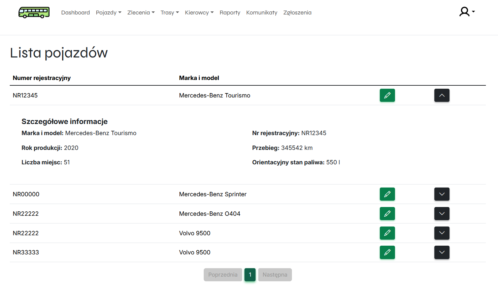
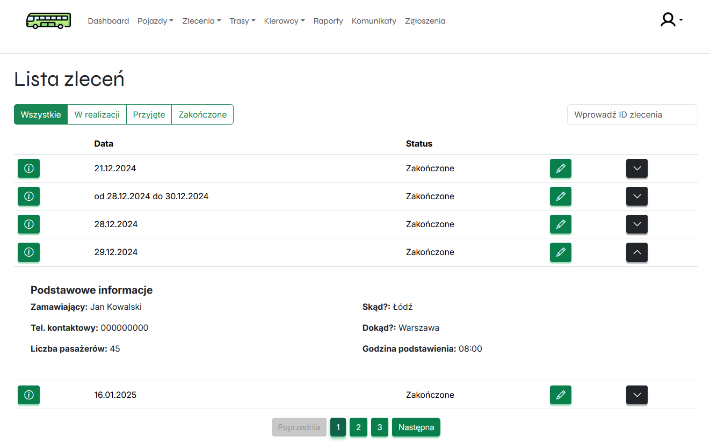
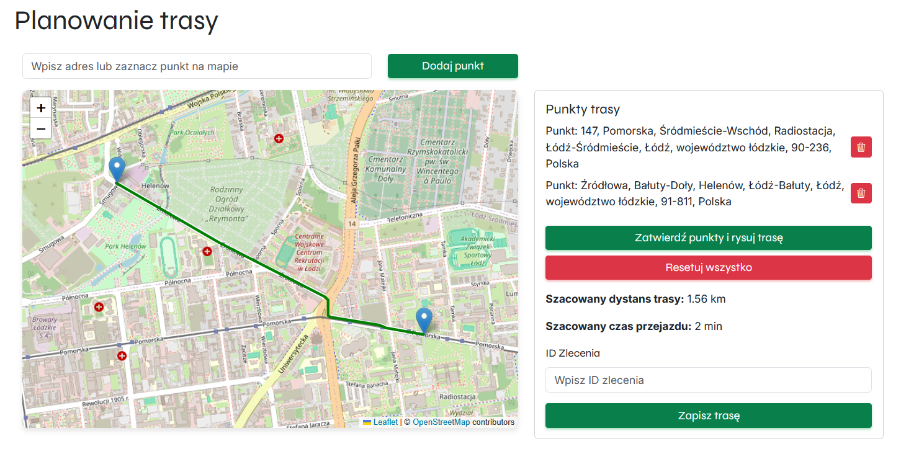

# TransportManagementApp

A comprehensive web application supporting the management of a transport company specializing in bus transport. The application enables the management of vehicles, orders, routes, and drivers.

## Features

### Vehicles

- Fleet registration and management:
  - Monitoring fuel levels and consumption.



### Orders

- Order management:
  - Tracking order status (accepted, in progress, completed).
  - Editing transport orders.



### Routes

- Route planning:
  - Defining waypoints and stops along the route.
  - Creating preview routes for orders.
- Route analysis:
  - Trip history and statistics.



### Drivers

- Driver management:
  - Tracking working hours and rest periods.
  - Adding and editing driver profiles.

### Reports

- Generating reports:
  - Reports for selected orders or repairs.
  - Summary reports with information on technical inspections.

## Tech Stack

- **Backend:** Spring Boot
- **Frontend:** React + Vite

## Installation

### Backend

1. Clone the repository:
   ```sh
   git clone https://github.com/your-username/your-repository.git
   ```
2. Navigate to the backend directory:
   ```sh
   cd your-repository/backend
   ```
3. Build and run the application:
   ```sh
   ./mvnw spring-boot:run  # For Maven
   ```

### Frontend

1. Navigate to the frontend directory:
   ```sh
   cd your-repository/frontend
   ```
2. Install dependencies:
   ```sh
   npm install
   ```
3. Start the development server:
   ```sh
   npm run dev
   ```

## License

This project is licensed under the MIT License. You are free to use, modify, and distribute this software, provided that the original copyright and license notice appear in all copies or substantial portions of the software.

### MIT License

Permission is hereby granted, free of charge, to any person obtaining a copy of this software and associated documentation files (the "Software"), to deal in the Software without restriction, including without limitation the rights to use, copy, modify, merge, publish, distribute, sublicense, and/or sell copies of the Software, and to permit persons to whom the Software is furnished to do so, subject to the following conditions:

The above copyright notice and this permission notice shall be included in all copies or substantial portions of the Software.

THE SOFTWARE IS PROVIDED "AS IS", WITHOUT WARRANTY OF ANY KIND, EXPRESS OR IMPLIED, INCLUDING BUT NOT LIMITED TO THE WARRANTIES OF MERCHANTABILITY, FITNESS FOR A PARTICULAR PURPOSE, AND NONINFRINGEMENT. IN NO EVENT SHALL THE AUTHORS OR COPYRIGHT HOLDERS BE LIABLE FOR ANY CLAIM, DAMAGES, OR OTHER LIABILITY, WHETHER IN AN ACTION OF CONTRACT, TORT, OR OTHERWISE, ARISING FROM, OUT OF, OR IN CONNECTION WITH THE SOFTWARE OR THE USE OR OTHER DEALINGS IN THE SOFTWARE.

